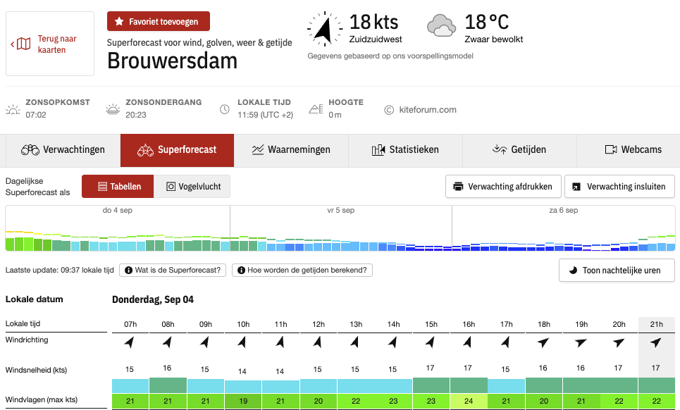

# Windfinder-Notify

A modular Python script to scrape wind speed forecasts from Windfinder and send email notifications for kitesurfing spots when conditions meet thresholds.

Runs daily at 8 AM UTC.



## Configuration
Edit `config.yaml`:
```yaml
spots:
  brouwersdam:
    url: https://nl.windfinder.com/weatherforecast/brouwersdam
    emails: [user@example.com]
    threshold: 20
    min_hours: 3
    start_hour: 8
    end_hour: 20
```

